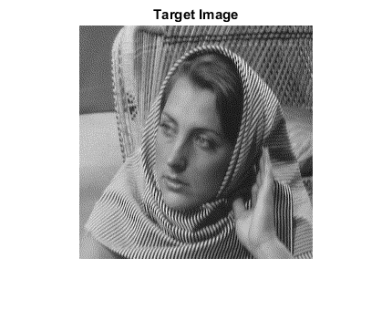
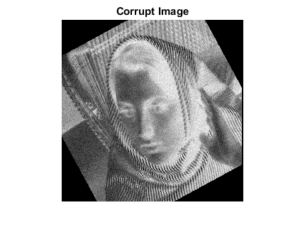
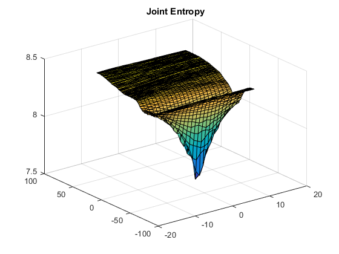
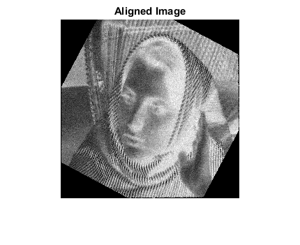
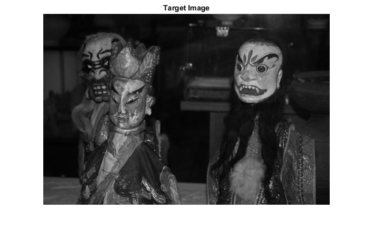
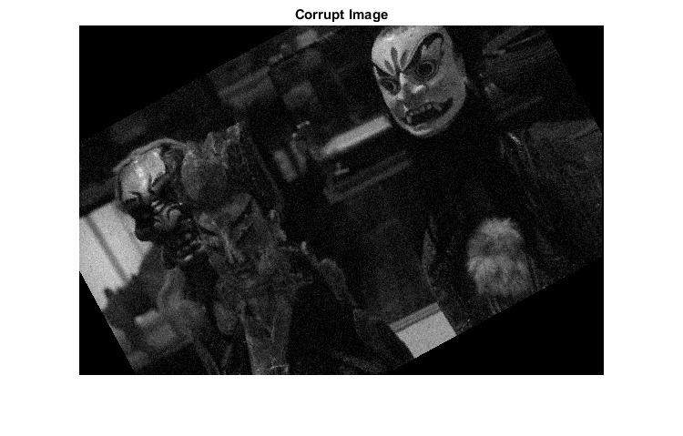
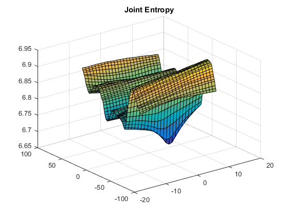
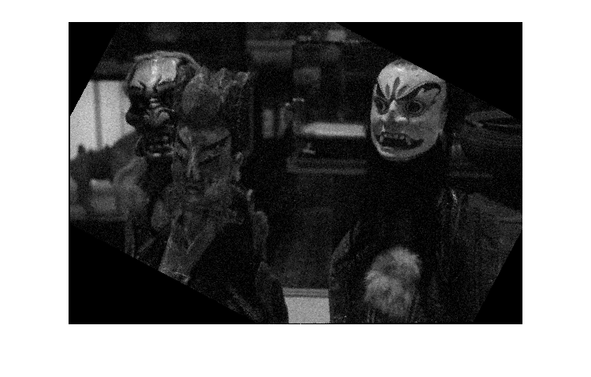
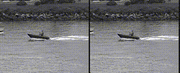
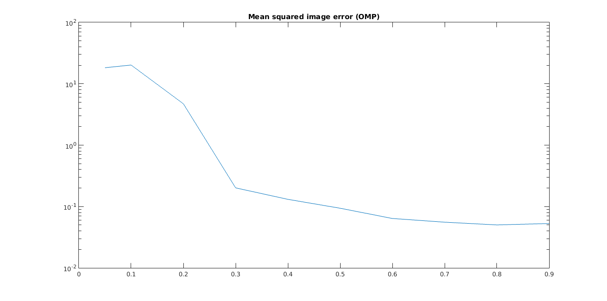

# Computer Vision (CS:763, IIT Bombay)
This repository contains some code and materials developed in IITB's course, taken by [Prof. Ajit Rajwade](https://www.cse.iitb.ac.in/~ajitvr/). Please visit the repo for the full code.

### Image Registration
The problem statement can be found [here](./image_alignment/problem_statement.pdf).

I used joint entropy as a loss function to register two images with signification colour difference (negative or use of flash), where the image has been rotated and translated.

| Reference image | Input image | Joint entropy map | Aligned image |
| ---- | ----- |----- | ---- |
|  |  |  |  |
|  |  |  |  |

### Video stabilization

Using SIFT points and registering them across the frames, we can get an estimate of the motion of the camera. I performed stabilization where the input video has been corrupted with rigid transformations.

Results: 

Left side is input video; right side is output.

### Compressed sensing

I implemented an OMP based algorithm to perform reconstruction of the barbara image captured at different levels of compression.

Here is the plot for the error v the compression factor:

The full report can be found [here](./compressed_sensing/report.pdf).